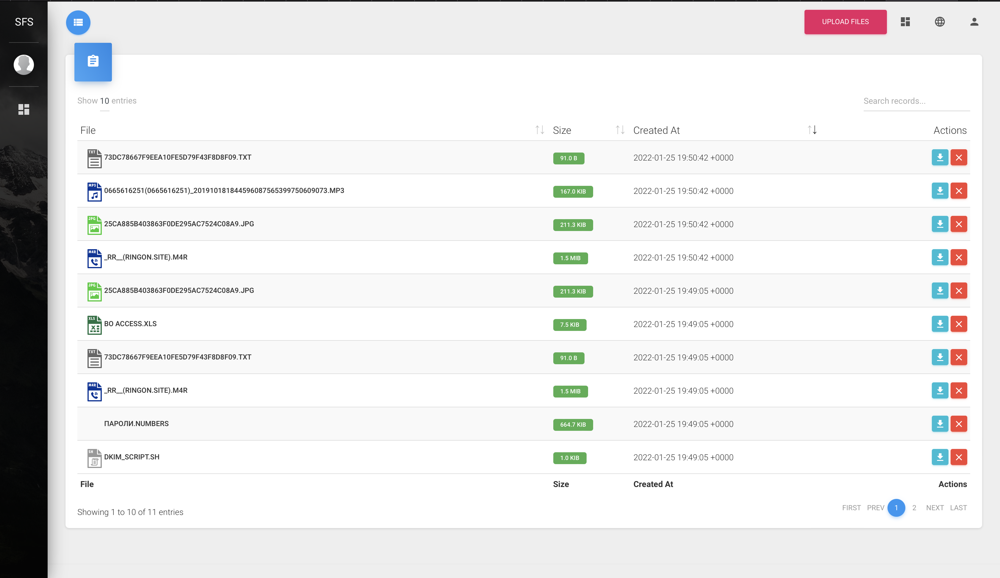

# Simple File Server
Simple example of File Server on Django
with: 
1. Basic Authorization

2. Basic Admin panel
3. Uploading files with "drag & drop"

4. Simple file management with basic information (file name, size, date time)
